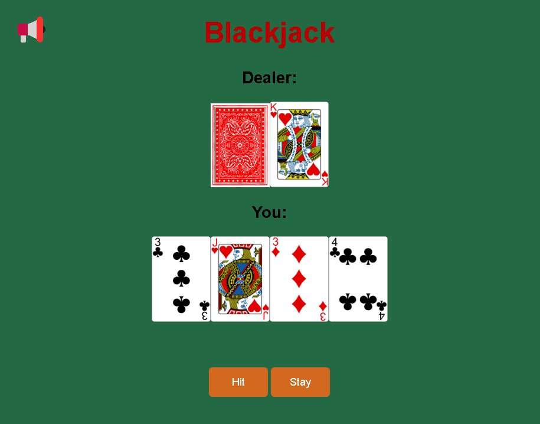

# Blackjack Game 🃏

This is a simple web-based version of the classic card game, built using **HTML, CSS, and JavaScript**.

  

## Features
- Classic Blackjack rules.
- Dealer Bot that follows standard gameplay rules.
- Responsive design for various screen sizes.
- Simple and intuitive user interface.
- Dynamic gameplay with animations.

## How to Play
1. The goal is to get as close to 21 as possible without going over.
2. Players are initially dealt two cards and can choose to "Hit" (get another card) or "Stand" (end their turn).
3. The dealer will reveal their hidden card once the player stands and will hit or stand based on the total hand value.
4. If the player's hand exceeds 21, they lose (bust). The same goes for the dealer.
5. Whoever has the closest hand to 21 without busting wins.

## License

MIT License
